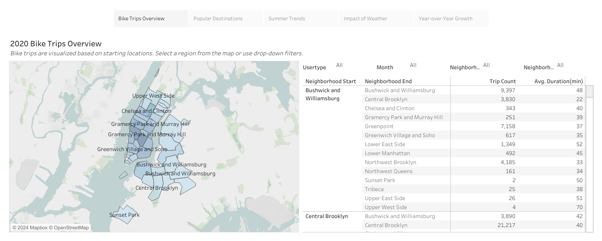
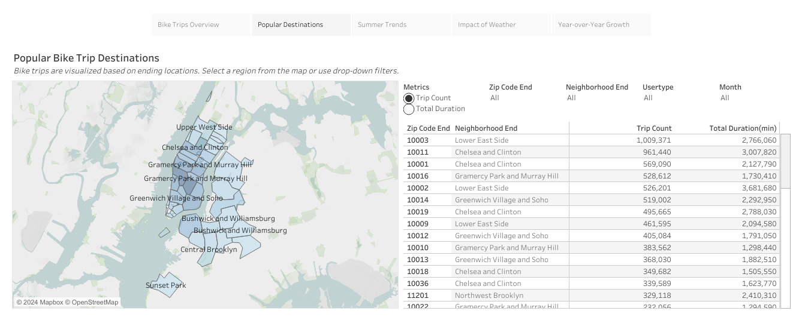
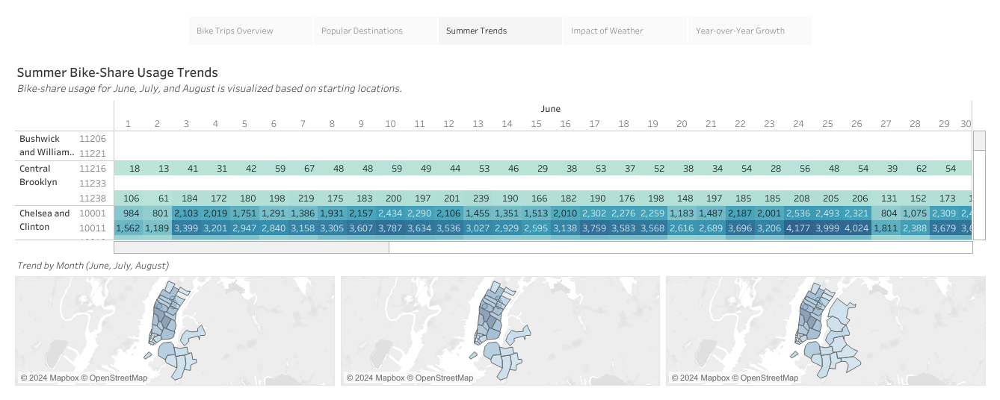
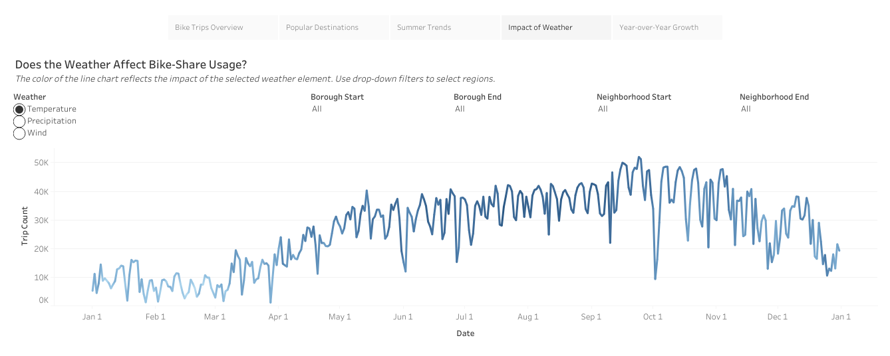
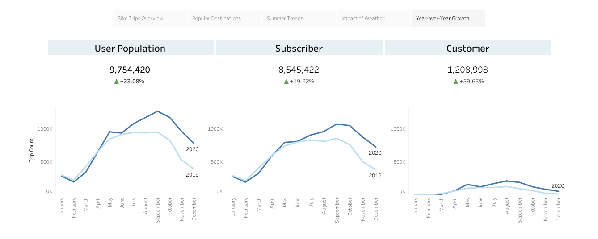

# bike-share-business-intelligence

Cyclistic, a fictional bike-share company, has partnered with the City of New York to offer shared bikes across Manhattan and neighboring boroughs, providing customers with convenient travel options between bike stations.

For the upcoming year's business plan, this project aims to deliver BI value and enhance organizational data maturity for the Customer Growth Team through analysis of 2020 bike trip data. 

The initial stage involved creating [Stakeholder Requirements Document](documents/Stakeholder%20Requirements%20Document.pdf), [Project Requirements Document](documents/Project%20Requirements%20Document.pdf), and [Strategy Document](documents/Strategy%20Document.pdf) which detailed the project's purpose and requirements.

A comprehensive dataset was then generated on BigQuery, utilizing real-life [NYC Citi Bike trips](https://console.cloud.google.com/marketplace/details/city-of-new-york/nyc-citi-bike) data along with data on [US Boundaries](https://console.cloud.google.com/marketplace/product/united-states-census-bureau/us-geographic-boundaries) and [GSOD](https://console.cloud.google.com/marketplace/details/noaa-public/gsod) that are publicly available. Additionally, [zip code](data/Cyclistic%20NYC%20zip%20codes%20-%20list.csv) data was manually uploaded to enrich the dataset. Two target tables were generated through SQL queries: one containing [bike trip data for 2020](bike%20trips%202020.sql) and the other containing [trip counts for 2019 and 2020](trip%20count%202019-2020.sql).

Following data acquisition and transformation, an interactive [Tableau dashboard](https://public.tableau.com/app/profile/yl5787/viz/BikeTripsDashboard_17115048679880/Story) was developed to present key insights and findings.

Lastly, an [Executive Summary](documents/Executive%20Summary.pdf) was prepared to offer stakeholders a clear understanding of the project's objectives and overview.

